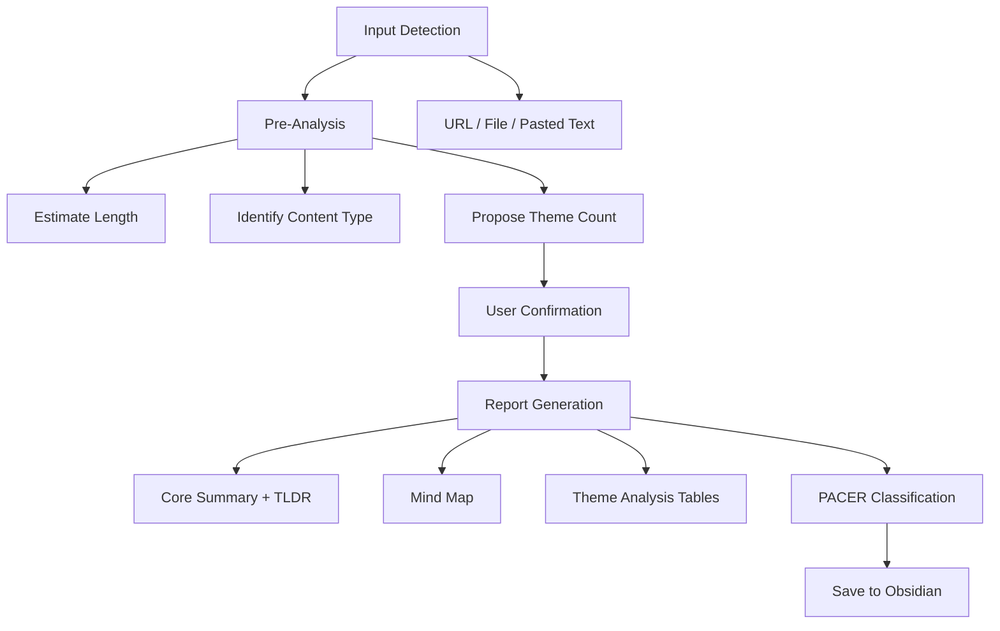

# claude-code-summarizer


A Claude Code skill that analyzes articles, podcasts, and video transcripts into structured bilingual Obsidian notes with actionable knowledge taxonomy.

## Problem

Knowledge workers consume articles, podcasts, and video transcripts daily but struggle to extract lasting value from them. Manual note-taking is slow, inconsistent, and rarely produces actionable output. When content spans multiple languages, the friction compounds -- valuable insights get lost between consumption and application.

Most summarization tools produce flat bullet lists that strip away context and structure. What knowledge workers actually need is a systematic analysis framework that transforms raw content into organized, searchable, and actionable notes that integrate into their existing knowledge management system.

## Features

- **4-phase structured analysis workflow** -- from input detection through report generation, each phase builds on the previous to produce progressively deeper analysis
- **PACER knowledge taxonomy** -- classifies content into five categories (Procedural, Analogous, Conceptual, Evidence, Reference), each with tailored action templates that tell you exactly how to digest what you just read
- **Bilingual output** -- English for concepts, dimension names, and technical terms; Chinese for descriptions, analysis, and recommendations
- **Mind map generation** -- text-based tree structure using box-drawing characters for a visual overview of content structure and logical relationships
- **Theme analysis tables** -- each theme gets a structured table with dimensions, insights, and supporting evidence, followed by actionable recommendations
- **Obsidian-native formatting** -- callout blocks, properties frontmatter, and foldable sections designed for seamless integration with Obsidian vaults

## Usage

### Installation

Copy `SKILL.md` to your `.claude/skills/` directory:

```bash
mkdir -p ~/.claude/skills/summarizer
cp SKILL.md ~/.claude/skills/summarizer/SKILL.md
```

Then ask Claude Code to summarize any article, transcript, or text content. The skill activates automatically when you share a URL, file path, or paste text with a summarization request.

### Example Output

Below is a sample from an analysis of a podcast transcript. The skill produces structured sections like the Core Summary:

> **Core Summary - TLDR**
>
> Dharmesh Shah is HubSpot's co-founder and CTO. This podcast reveals how he built HubSpot into a $30B public company through a series of unconventional decisions -- refusing to manage direct reports, betting on the SMB market, and treating culture as a product.
>
> - **Strengths-First Design**: Zero direct reports across 7,000+ employees, focusing entirely on product and engineering thinking
> - **High-Conviction, Low-Consensus Bets**: Persisting on SMB market and all-in-one product strategy despite 18 years of external skepticism
> - **Simplicity as a Fighting Principle**: Systematic mechanisms (feature net-zero rules, seat lottery algorithms) to combat organizational entropy
> - **Culture as Product**: Quarterly employee NPS, public bug reports, iterating culture like shipping code

And structured theme analysis tables like this:

| Dimension | Insight | Supporting Evidence |
|-----------|---------|---------------------|
| **No Direct Reports** | Established a "zero direct reports" contract from day one, freeing capacity for high-output product work | "7,000 plus employees? Exactly zero direct reports from time T equals zero." |
| **Quantified Skill Building** | Engineered public speaking as a measurable skill using LPM (Laughs Per Minute) metrics and custom analysis software | "I have custom software that will say, 'here are the points at which the audience laughed.'" |

Each theme concludes with Top 3 Actionable Recommendations synthesized across all dimensions.

## Architecture



**Phase 1: Input Detection** -- Identifies the content source (URL, file path, or pasted text) and acquires the raw content for analysis.

**Phase 2: Pre-Analysis** -- Estimates content length, identifies content type (article, podcast, interview, technical doc), and proposes an appropriate number of themes based on complexity.

**Phase 3: User Confirmation** -- Presents the proposed analysis plan and asks 1-3 quick confirmation questions before proceeding. Respects any preferences already specified in the prompt.

**Phase 4: Report Generation** -- Produces the full structured report: Core Summary with TLDR callout, text-based Mind Map, Theme Analysis tables with evidence and recommendations, and PACER knowledge classification with tailored action steps. The report is saved as an Obsidian-compatible markdown file.
